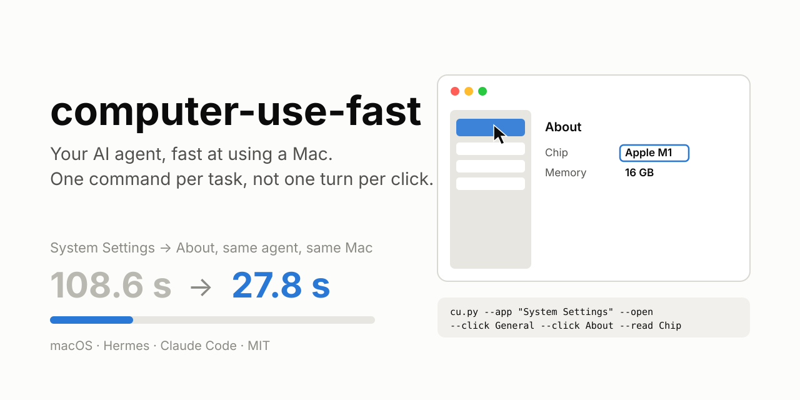

# computer-use-fast

> Make your AI agent fast at using a Mac. Ask it to open an app, click through it, type, read the screen or send
> a screenshot, and it is done in about 25 seconds instead of 50 to 100.

[繁體中文說明](./README.zh-TW.md)

## Highlights

- **2–4× faster GUI tasks, measured.** Same agent, same Mac: System Settings → About went from 108.6 s to
  27.8 s, Calculator with a screenshot from 52 s to 25.1 s. [Every measurement →](docs/benchmarks.md)
- **One command per task, not one agent turn per click.** About 90% of a step-by-step run is the agent
  thinking between clicks. `cu.py` opens the app, clicks buttons by their visible text, types, picks menus,
  fills fields, waits, reads the screen and saves a screenshot in a single call, so those turns disappear.
- **Runs in the background.** It acts through macOS accessibility, not the mouse: clicking, typing, filling
  fields, reading and even opening apps and pages left the app you were using in front and the pointer where it
  was, sampled every 50 ms by a tool independent of the driver. Dragging, and menu commands that open a new
  window, are the exceptions. The driver runs natively on your Mac, not in a container or VM. [Measured →](docs/benchmarks.md#5-does-it-take-over-the-screen)
- **Works on most apps.** 58 of the 74 apps tested on one Mac, including Safari, Chrome, Discord, VS Code,
  Word, Excel, Keynote, Mail, Notes, Finder and System Settings. Apps with nothing to drive get a clear reason.
- **Tested with three agents.** Claude Code, Hermes and Grok CLI each did System Settings, Calculator and a
  Safari task three times: 27 of 27 correct, Claude Code fastest at 14–29 s. [Results →](docs/benchmarks.md#6-three-agents-three-tasks-three-runs-each)
- **Any system language, no API key.** Localized app and button names work (計算機, 一般). It all runs on
  your Mac.
- **For Hermes, Claude Code, or any agent that reads `SKILL.md`.** One command installs it, and one updates it.


## Quick start

```bash
# 1. The driver that does the clicking, and its two macOS permissions
/bin/bash -c "$(curl -fsSL https://cua.ai/driver/install.sh)"
cua-driver permissions grant

# 2. The skill: Hermes
hermes skills install Nanako0129/computer-use-fast/skills/computer-use-fast
#    or Claude Code
npx skills add Nanako0129/computer-use-fast -g -a claude-code --skill computer-use-fast -y
```

Other agents, Chrome and Electron apps, checking that it works, updating:
**[docs/setup.md](docs/setup.md)**

## Using it

Ask your agent as you normally would:

> Open System Settings and tell me which chip this Mac has.
> Open Calculator, work out 56 × 123 and send me a screenshot.
> In Safari, search Wikipedia for "hieroglyphs" and tell me what it says.

Behind the scenes the agent runs one line, for example:

```bash
cu.py --app "System Settings" --open --click General --click About --read Chip
```

## Docs

| | |
|---|---|
| [Setup](docs/setup.md) | Install, permissions, Chrome/Electron helper, making the agent use it, update, uninstall |
| [Command reference](docs/reference.md) | Every step, how matching works, output, exit codes, environment variables |
| [Benchmarks](docs/benchmarks.md) | All measurements: end to end, per command, before/after each fix, the Jev comparison, app coverage |
| [Troubleshooting](docs/troubleshooting.md) | Every message `cu.py` prints and what to do about it |

## License

MIT
