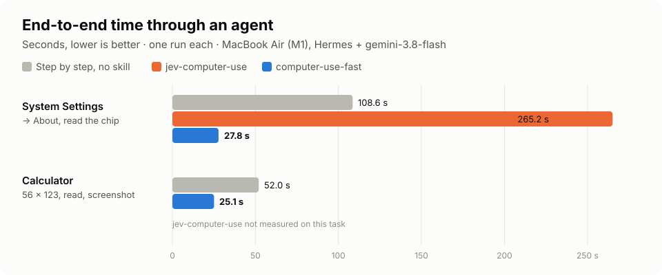
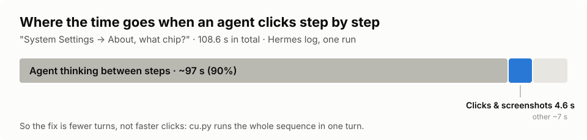
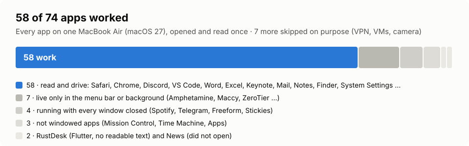

# Benchmarks

Everything here was measured on one machine on 2026-10-01: a MacBook Air (M1, 2020, 16 GB), macOS 27 in
Traditional Chinese, cua-driver 0.28.2, and the [Hermes](https://github.com/NousResearch/hermes-agent) agent
running `gemini-3.8-flash`. **Each number is a single run.** Expect your own to move with your model's latency.

## 1. Through an agent, end to end

From the moment the agent receives the request to its final answer, read from Hermes' session log.



| Task | Before | After | Speed-up | Tool calls |
|---|---|---|---|---|
| System Settings → General → About, "what chip?" | 108.6 s, step-by-step computer use | **27.8 s** | **3.9×** | 5 → 2 |
| Same task, asking for memory, installed from GitHub | — | **25.5 s** | — | 4 |
| Calculator: type 56 × 123, screenshot the result | 52 s, step-by-step computer use with typing instead of clicking | **25.1 s** | **2.1×** | 7 → 2 |
| Calculator, same request, before any tuning | 239 s (20 model calls) | **25.1 s** | 9.5× | — → 2 |

The last row is not a fair comparison and is listed only because it was the starting point: that run also lost
95 s to a hung `osascript` call and carried a 160 000-token conversation. The "Before" of rows 1 and 3 is
the agent with its own computer-use tool and a set of speed rules (type, don't click; read text, don't
screenshot).

### Where the time went



In the 108.6 s run, the six tool calls themselves took 4.6 s. The rest was the agent thinking between them.
That is why the skill cuts turns rather than making clicks faster.

### Compared with jev-computer-use

[jev-computer-use](https://github.com/kerpopule/hermes-jev-skills) attacks the same problem with
[TypeSafe Jev](https://docs.typesafe.ai), a small model that picks each next action from the accessibility tree.
Same machine, same agent, same System Settings task:

| | Time | Tool calls | Notes |
|---|---|---|---|
| Step by step | 108.6 s | 5 | |
| jev-computer-use | 265.2 s | 13 | its planner had no key, so each hop ran separately |
| jev-computer-use, planner key added | 94.4 s | — | the runner stopped twice (window not ready; click without effect) and the agent finished by hand |
| **computer-use-fast** | **27.8 s** | 2 | |

Jev itself was quick and accurate: 0.22–0.29 s per decision, confidence 0.98–0.99 on the right element. The
agent's turns around each step are what cost the time.

## 2. One `cu.py` call, by task

Wall time of a single `cu.py` command, run directly (no agent). These are the commands the agent issues.

| Task | Command (abridged) | Time |
|---|---|---|
| Calculator: type, read the result | `--app Calculator --open --type "56*123=" --read` | 3.3–4.6 s |
| TextEdit: new document from the menu, type, read back | `--menu "File > New" --type … --read` | 3.8 s |
| Reminders: read the window | `--app Reminders --open --read` | 3.5 s |
| Finder: two sidebar clicks, wait for a file, read | `--click Documents --click Applications --wait-for Calculator --read` | 10.5 s |
| System Settings: two clicks, read the chip | `--click General --click About --read Chip` | 11.6–17.2 s (the slower runs were already on that pane: a click with no visible change waits 3 s) |
| Safari: open an article, click a link, read a field | `--url … --wait-for … --click "Ptolemy V Epiphanes" --read Born` | 11.6 s |
| Safari: fill the search box, submit, wait for results | `--fill "Search Wikipedia=Hieroglyphs" --key return --wait-for …` | 15.8 s |
| Chrome: open an article, click a link, read a field | same as Safari | 17.0 s |
| Chrome: fill the search box, submit, wait | same as Safari | 21.8 s |
| Activity Monitor: filter the process list, read | `--fill "Search=Finder" --read Finder` | 19.8 s |
| Music: read the window (very large library) | `--app Music --open --read` | 32.4 s |

Big windows are slower to read: Activity Monitor and Music hold thousands of rows, and Music first runs into the
driver's 20-second walk limit before `cu.py` re-reads it shallowly.

## 3. Speed-ups inside `cu.py`

Fixes made while testing, each measured before and after on the same command:

| What changed | Command | Before | After |
|---|---|---|---|
| Check for a change with the first 300 elements, not a full walk | Safari, click a link | 7.7 s | 4.6 s |
| Keep the current window while polling instead of re-choosing it | Finder, click a sidebar row | 7–9 s | 3.4–4.6 s |
| Trust a native field's value write instead of re-reading the whole tree | Activity Monitor, fill the search box | 18.8 s | 10.4 s |
| Re-read shallowly (depth 10) when a full walk times out | Music, read | fails after 20 s | 2.6 s for the shallow walk |
| Raise the walk limit to 10 000 elements | Safari, read a whole Wikipedia article | cut off in the table of contents | full article in 1.7 s |

## 4. Which apps it works with



Every app installed on the test Mac, each opened and read once with `--open --read`. 58 of 74 worked, among them
Safari, Chrome, Discord, VS Code, Claude, Word, Excel, PowerPoint, Keynote, Mail, Notes, Contacts, Calendar,
Finder, System Settings, Preview, Automator, Shortcuts, Weather and Music. Seven more were skipped on purpose:
VPN clients (they would cut the test's own connection), virtual machines, and apps that switch the camera on.

| Did not work | Apps | Why |
|---|---|---|
| Menu-bar or background agents | Adobe Lightroom Downloader, Amphetamine, Maccy, TokenBar, UniFi Endpoint, LogiPluginService, ZeroTier | no window exists |
| Running with every window closed | Spotify, Telegram, Freeform, Stickies | no window exists until reopened |
| Not windowed apps | Mission Control, Time Machine, Apps | nothing to drive |
| Flutter | RustDesk | draws its own UI without readable text |
| Did not open | News | not determined |

Music failed in the first pass (the 20-second walk limit) and works since the shallow re-read was added; it is
counted among the 58.

## How to reproduce

```bash
# one cu.py call
time python3 <skill>/scripts/cu.py --app "System Settings" --open --click General --click About --read Chip
```

For the end-to-end numbers, ask the agent the same question with and without the skill installed and read the
turn's duration from its log (Hermes: `~/.hermes/logs/agent.log`, the `response ready … time=` line).
