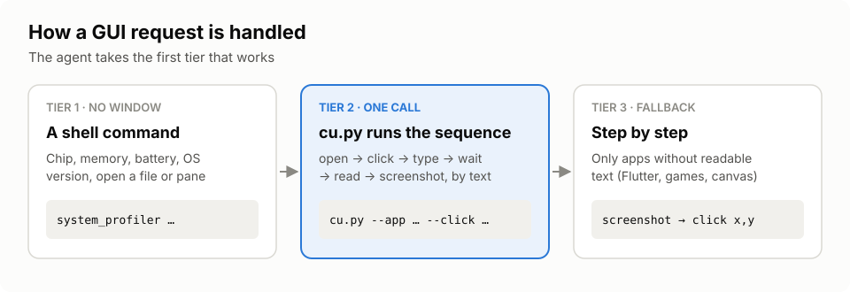

# Setup

Four steps; the last two are optional but recommended. Needs macOS and Python 3.9 or newer (no packages).



## 1. Install cua-driver

[cua-driver](https://github.com/trycua/cua) is what actually clicks and reads the screen; `cu.py` tells it what
to do. It runs natively on your Mac and drives your real desktop; it is not CUA's container or VM sandbox. Install it with its official installer and grant its permissions:

```bash
/bin/bash -c "$(curl -fsSL https://cua.ai/driver/install.sh)"
cua-driver permissions grant
```

`permissions grant` opens the macOS dialogs: allow **Accessibility** and **Screen Recording** for **CuaDriver**.
Check with:

```bash
cua-driver permissions status
```

The installer puts `cua-driver` in `~/.local/bin`; `cu.py` finds it on your `PATH`. If it lives elsewhere, set
`CUA_DRIVER_BIN` to its full path.

## 2. Install the skill

### Hermes Agent

```bash
hermes skills install Nanako0129/computer-use-fast/skills/computer-use-fast
```

The last lines tell you where it went (`Installed: …`); it lives under `~/.hermes/skills/`. Add
`--category <folder>` to choose the folder. Hermes tracks the source from then on, so updating is one command
(see below).

### Claude Code

```bash
git clone https://github.com/Nanako0129/computer-use-fast ~/src/computer-use-fast
mkdir -p ~/.claude/skills
cp -R ~/src/computer-use-fast/skills/computer-use-fast ~/.claude/skills/
```

### Other agents

Copy the folder `skills/computer-use-fast/` into the agent's skills folder. The agent must be able to run a
terminal command. Keep `SKILL.md` and `scripts/` together: the skill refers to `scripts/cu.py` next to itself.

## 3. Check that it works

`<skill>` below is the folder from step 2 (for example `~/.claude/skills/computer-use-fast`).

```bash
python3 <skill>/scripts/test_cu.py
python3 <skill>/scripts/cu.py --app Calculator --open --type "1+1=" --read
```

The first prints `ok` (it needs no driver). The second opens Calculator and prints a line containing `2`.
Anything else: [troubleshooting.md](troubleshooting.md).

## 4. Optional: Chrome, Edge, Brave, Arc and Electron apps

Chromium browsers and Electron apps (Discord, VS Code, Claude …) hide their content from accessibility tools
until one asks them to show it. Without this step those apps show only their menu bar; Safari and every
native app work regardless.

A 20-line helper does the asking. Build it:

```bash
mkdir -p ~/.local/share/computer-use-fast
swiftc -O <skill>/scripts/axenable.swift -o ~/.local/share/computer-use-fast/cu-axenable
```

`swiftc` comes with Xcode or its Command Line Tools (`xcode-select --install`).

Then allow it, which only you can do:

1. Open **System Settings → Privacy & Security → Accessibility**.
2. Press **+**, then **⌘⇧G**, paste `~/.local/share/computer-use-fast/cu-axenable` and press **Open**.
3. Confirm with your password or Touch ID if asked, and make sure its switch is on.

Why it lives outside the skill folder: macOS ties the permission to that exact file. Updating the skill must not
replace it. Rebuilding it does, so allow it again after a rebuild.

## 5. Recommended: tell the agent to use it

An agent loads a skill when it judges the skill relevant, and an agent that knows another way to click will
sometimes take it. One line in its standing instructions makes this reliable:

| Agent | Where |
|---|---|
| Hermes | `~/.hermes/SOUL.md` |
| Claude Code | `~/.claude/CLAUDE.md` or the project's `CLAUDE.md` |

```
For any task on a Mac app's screen, load the computer-use-fast skill first and follow it.
Never use osascript or System Events to control apps.
```

The second line matters: on the test Mac, `osascript` driving System Events hung for 76 s in one run and timed
out after 120 s in another.

## Update and uninstall

| | Hermes | Claude Code |
|---|---|---|
| Is there a new version? | `hermes skills check` | `git -C ~/src/computer-use-fast fetch && git -C ~/src/computer-use-fast status` |
| Update | `hermes skills update computer-use-fast` | `git -C ~/src/computer-use-fast pull`, then repeat the `cp -R` |
| Uninstall | `hermes skills uninstall computer-use-fast` | `rm -rf ~/.claude/skills/computer-use-fast` |

The Chrome helper, if you built it: `rm -rf ~/.local/share/computer-use-fast`, then remove `cu-axenable` from
the Accessibility list.
